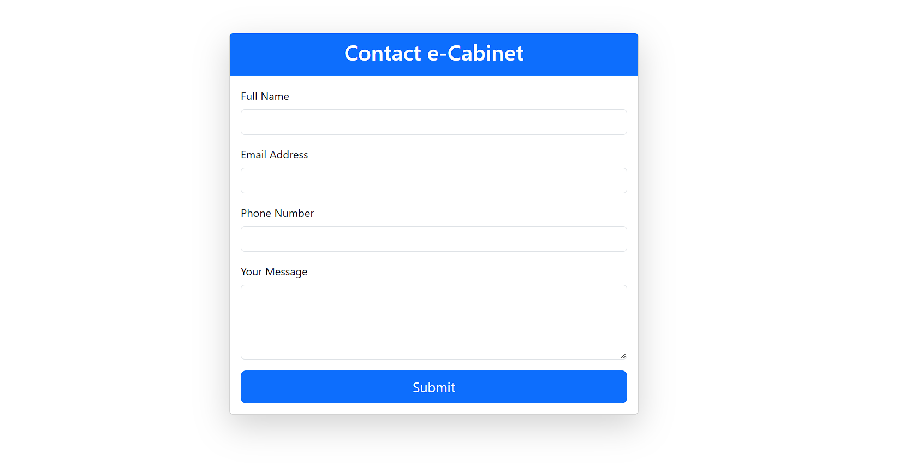
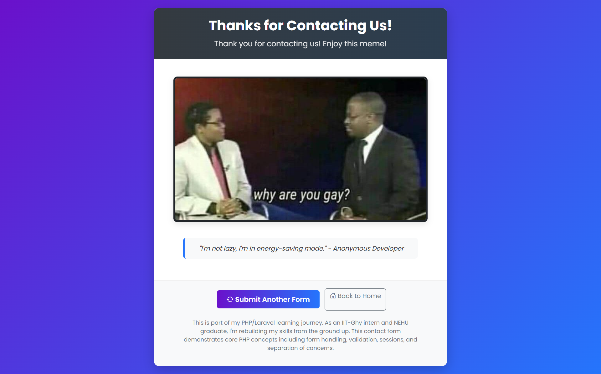

# PHP Contact Form with Meme Reward System

[](https://php.net/)
[](https://getbootstrap.com/)
[](LICENSE)

A professional contact form implementation with server-side validation, session management, and an engaging meme reward system. Demonstrates core PHP concepts while providing a foundation for Laravel development.

## Table of Contents
- [Features](#features)
- [Screenshots](#screenshots)
- [Technology Stack](#technology-stack)
- [Installation](#installation)
- [Project Structure](#project-structure)
- [Development Roadmap](#development-roadmap)
- [Learning Journey](#learning-journey)
- [Contributing](#contributing)
- [License][def]
- [About Me](#about-me)

## Features

- **Modern UI/UX**
  - Responsive Bootstrap 5 design
  - Interactive form elements with validation
  - Smooth transitions and animations
- **Robust Form Handling**
  - Server-side validation and sanitization
  - Session-based flash messages
  - Object-oriented processing architecture
- **Engaging Reward System**
  - Meme display after successful submission
  - Professional presentation layer
- **Well-Organized Architecture**
  - Separation of concerns (presentation vs logic)
  - Scalable folder structure
  - Simulated database storage

## Screenshots

<div align="center">
  <h3>Contact Form Interface</h3>
  
  
  <h3>Meme Reward Page</h3>
  
  
  <h3>Mobile Responsive Design</h3>
  
</div>

## Technology Stack

| Component       | Technology |
|-----------------|------------|
| **Frontend**    | Bootstrap 5.3, CSS3, HTML5 |
| **Backend**     | PHP 8.0+, Session Management |
| **Validation**  | Server-side sanitization, Regex patterns |
| **Development** | VS Code, Git, PHP Built-in Server |
| **Design**      | CSS Animations, Responsive Layouts |

## Installation

### Prerequisites
- PHP 8.0 or higher
- Web browser

### Setup Instructions
1. Clone the repository:
```bash


[def]: #license